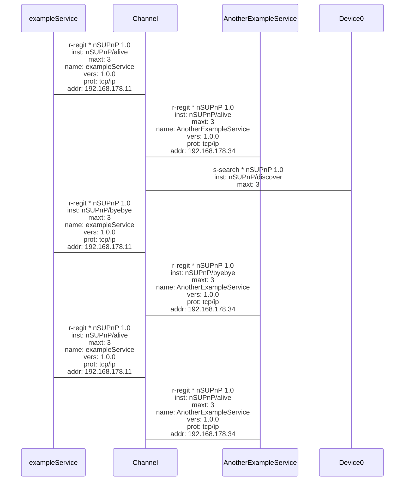

# NSUPNP
nsupnp is the acronym for non standard universal plug and play. Its a small library that allows you to make devices or services discoverable on your network and find out about their use and usage.

## example

```python
from nsupnp.simple import SimpleNsupnp  
import os  
import random  
  
sc = SimpleNsupnp('Test' + str(random.randint(10000, 90000)), 'NONE', 'NONE', '0.005')  
  
while True:  
  sr = sc.services()  
  os.system('cls')  
  print([i.name for i in sr])  
  print([i.version for i in sr])  
  print([i.protocol for i in sr])  
  print([i.timeout for i in sr])  
  print([i.address for i in sr])
```


## example diagrams (often not rendered properly)




