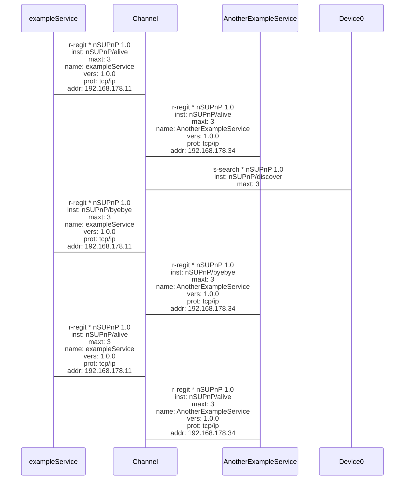

# NSUPNP-python
Non standard universal plug and play is a small library that allows you to make devices or services discoverable on your network and find out about their use and usage.  

## usage
  There are two main files provided by nsupnp. The first one is called ```simple``` the second one ```main```.
  ```main``` is the low level basis of ```simple``` and is much more complicated than ```simple```.

### usage for ```simple```
the usage of ```simple``` is fairly easy, it only contains one class which you just have to construct an instance to register a service and to destruct the instance to unregister it.

It also gives you the a function(```services()```) to discover other services after it has been constructed.

The following code will show all found devices and services in the terminal.
```python
from nsupnp.simple import SimpleNsupnp    
import os    
import random    
    
sc = SimpleNsupnp('Test' + str(random.randint(10000, 90000)), 'NONE', 'NONE', '0.005')    
    
while True:    
  sr = sc.services()    
  os.system('cls')    
  print([i.name for i in sr])    
  print([i.version for i in sr])    
  print([i.protocol for i in sr])    
  print([i.timeout for i in sr])    
  print([i.address for i in sr])  
```

### usage for ```main```
the usage of ```main``` isnt as easy but gives you a lot of functions that can become quite handy.

It has four main classes from which only one is really usefull for you.

The first one is the ```Service``` class it is the object given back by a discovery call.
The second one is the ```udpClient``` class which provides a simple udp client which can send udp messages
The third one is the ```udpServer``` class which provides a functionality **only for the** ```nonStandardUniversalPlugAndPlay``` class!

The last and most important one is the ```nonStandardUniversalPlugAndPlay``` class.

The ```nonStandardUniversalPlugAndPlay``` class gives you three functions.
The ```register(serviceName: str, serviceVersion: str, serviceProtocol: str, serviceAddress: str,  
  timeout: int = 3)``` function which allows you register as many services as you want.
The ```unregister(serviceName: str, serviceVersion: str, serviceProtocol: str, serviceAddress: str,  
  timeout: int = 3)``` function which allows you unregister as many services as you want.
The ```discover(,  
  timeout: int = 3)``` function which allows find all registered services.

This code does exactly the same as the one of ```simple``` but is much more complicated than it.
```python  
from examples.main import nonStandardUniversalPlugAndPlay  
import os  
from random import randint  
import socket  
import time  
  
  
upnpClient = nonStandardUniversalPlugAndPlay()  
  
upnpService = ('DEBUG SERVICE' + str(randint(1000, 9999)), '0', 'nsupnp', str(socket.gethostbyname(socket.gethostname())), '-1')  
  
upnpClient.register(*upnpService)  
  
upnpClient.discover()  
  
  
def show():  
  print('-- show --')  
  print()  
  print(len(upnpClient.registeredOtherServices))  
  print('Cycle time:', time.time()- cycleTime)  
  print()  
  print([i.name for i in upnpClient.registeredOtherServices])  
  print([i.version for i in upnpClient.registeredOtherServices])  
  print([i.protocol for i in upnpClient.registeredOtherServices])  
  print([i.timeout for i in upnpClient.registeredOtherServices])  
  print([i.address for i in upnpClient.registeredOtherServices])  
  print('-- -  - --')  
  
  
cycleTime = time.time()  
oldLen = None  
try:  
  while True:  
  if time.time() - cycleTime > .5:  
  upnpClient.discover()  
  cycleTime = time.time()  
  
  if oldLen is not len(upnpClient.registeredOtherServices):  
  oldLen = len(upnpClient.registeredOtherServices)  
  os.system('cls')  
  show()  
except KeyboardInterrupt:  
  upnpClient.unregister(*upnpService)
```  
  
  
## example com diagrams (often not rendered properly)  
  
  

